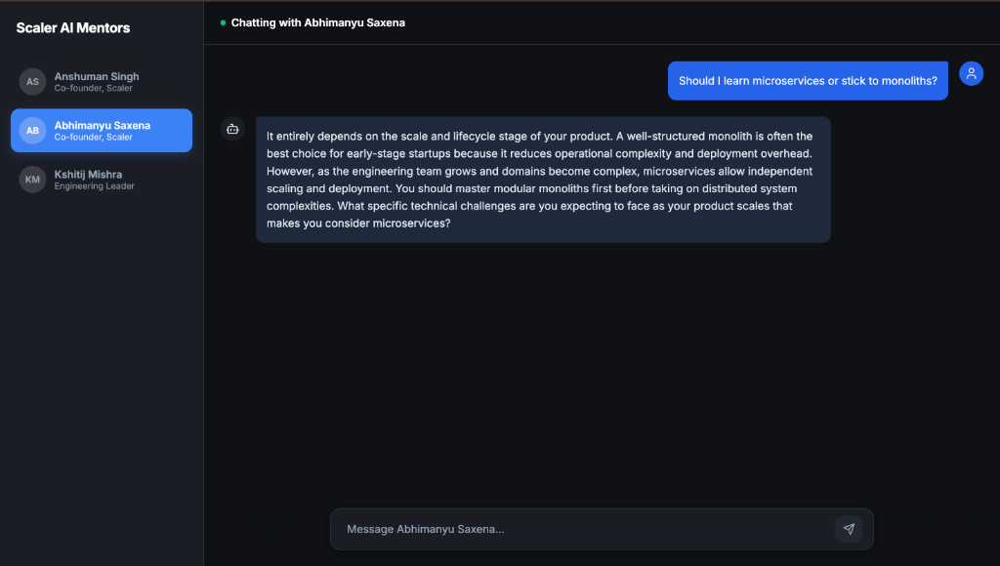
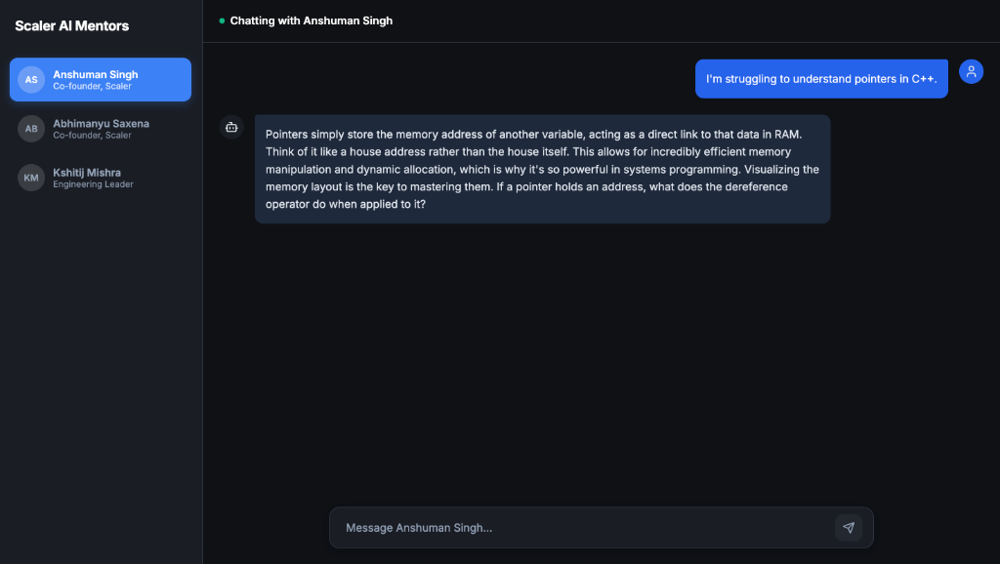
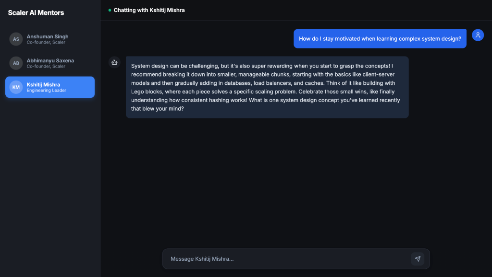

<div align="center">
  
  
  <h1>🚀 Scaler AI Mentorship Hub</h1>
  <p><i>An immersive, context-driven AI chatbot featuring Scaler's top educators.</i></p>

  <p align="center">
    <a href="https://nextjs.org/"></a>
    <a href="https://reactjs.org/"></a>
    <a href="https://groq.com/"></a>
    <a href="https://scaler-persona-chatbot-bice.vercel.app/"></a>
  </p>
</div>

<br/>

Welcome to the **Persona-Based AI Chatbot**! Built for Assignment 01, this platform delivers an authentic 1-on-1 mentoring experience with three legendary Scaler personalities: **Anshuman Singh**, **Abhimanyu Saxena**, and **Kshitij Mishra**.

By leveraging highly customized system instructions—complete with few-shot learning, chain-of-thought protocols, and rigorous behavioral boundaries—the LLM accurately mirrors the unique teaching philosophy and communication style of each mentor.

---

### 🔗 Live Preview
Check out the fully functional application here: **[Live Vercel Deployment](https://scaler-persona-chatbot-bice.vercel.app/)**

---

## 💻 Application Interface

Here is how the application looks when interacting with the different mentors:

<p align="center">
  
  
</p>

---

## 🔥 Core Capabilities

- 🔄 **Fluid Persona Switching**: Instantly switch between mentors. The UI state, chat history, and context window adapt immediately.
- 🛡️ **Ironclad Prompt Engineering**: System prompts are safely isolated on the backend. This prevents prompt leakage while ensuring the AI remains strictly in character.
- 💅 **Modern Aesthetic**: Designed entirely with Vanilla CSS Modules, featuring a sleek dark-mode, glassmorphic headers, and smooth typing indicators.
- ⚡ **Blazing Fast Responses**: Utilizing the `groq-sdk` to connect to the cutting-edge `llama-3.1-8b` model for near-instantaneous text generation.

---

## 🏗️ Architecture & Stack

| Component | Technology Used | Implementation Details |
| :--- | :--- | :--- |
| **Frontend UI** | **Next.js (App Router)** | Provides a robust React foundation with seamless client-side state management. |
| **Styling** | **Pure CSS Modules** | Ensures highly scoped, conflict-free styling without relying on external utility frameworks. |
| **Backend API** | **Next.js Serverless Routes** | Securely handles the LLM communication layer, keeping API keys strictly on the server. |
| **AI Engine** | **Groq API** | Delivers ultra-low latency inference using open-source Llama 3 models. |

---

## ⚙️ Local Development Guide

Want to run this project on your own machine? Follow these simple steps:

**1. Clone the repository:**
```bash
git clone https://github.com/vanshkamra12/scaler-persona-chatbot.git
cd scaler-persona-chatbot
```

**2. Install dependencies:**
```bash
npm install
```

**3. Configure your environment:**
Create a `.env.local` file in the root directory and add your Groq API key:
```env
GROQ_API_KEY=your_groq_api_key_here
```

**4. Spin up the dev server:**
```bash
npm run dev
```
Navigate to `http://localhost:3000` to interact with the mentors!

---

## 📄 Required Documentation

As mandated by the grading rubric, the following resources are located in the project root:

* 🧠 `prompts.md`: A comprehensive breakdown of the system prompts, including context definitions, few-shot examples, and behavioral constraints.
* 📝 `reflection.md`: A deep-dive reflection on the challenges of prompt engineering and the critical importance of the GIGO (Garbage In, Garbage Out) principle.
* 🔒 `.env.example`: A template showing required environment variables without exposing sensitive credentials.
